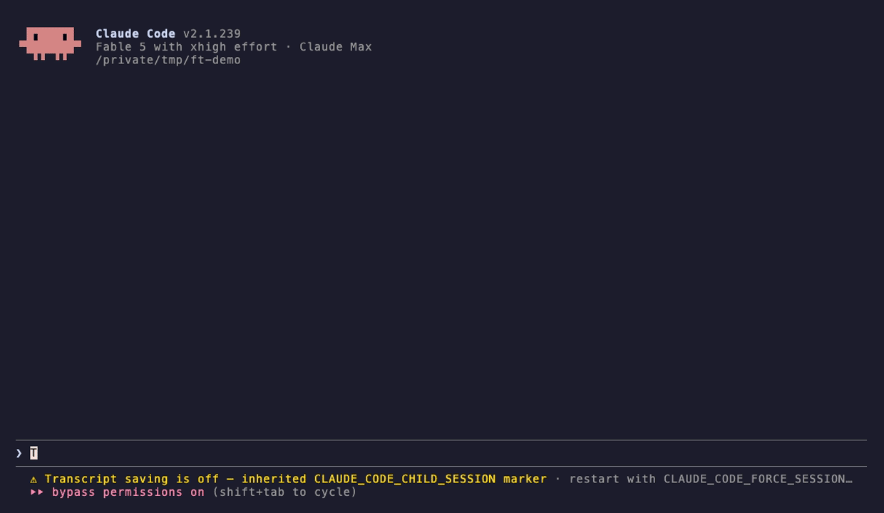
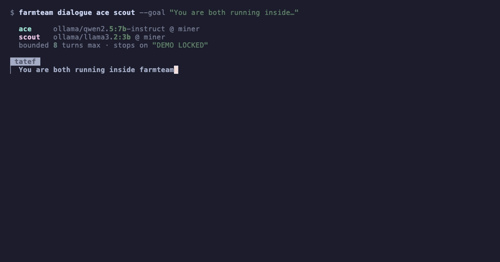

# 🍳 yeschef

**A kitchen for Claude Code and Codex.** Local models on your own hardware — your line
of *cooks* — that take the grunt work, talk it out in bounded rooms, and never hit a
rate limit. You call the order; a cook works the ticket; the plate comes back.

You pay per token and wait out rate limits while the GPUs you already own sit idle.
yeschef turns them into a line Claude Code can actually run: fire a ticket, keep working,
check the pass whenever — from any session, days later. You're the chef doing the
thinking; the kitchen does the reps.



*One prompt, live session: Claude shows the line — every cook's model and machine
(`grill · ollama/qwen2.5:7b-instruct @ miner`) — fires the buildout, and spawns the
`yeschef-expediter` subagent, visible in the native panel like any subagent. The session
comes straight back to you; when the cook finishes, the expediter calls it back on its
own, plates the files in `./site`, and Claude tastes the cook's work against the spec.
No hovering, no "is it up yet."*

```
   Claude Code ──MCP/HTTP──▶ ┌─────────┐ ◀──REST+SSE── cook ──▶ Ollama  (office-mac)
   (any session,             │   hub   │ ◀──REST+SSE── cook ──▶ vLLM    (gpu-box)
    any machine)             │ SQLite  │ ◀──REST+SSE── cook ──▶ any /v1 (spare-pc)
                             │  (pass) │
                             └─────────┘
```

|   | Without a kitchen | With one |
|---|---|---|
| Grunt work (summarize, classify, extract, triage) | burns your Claude tokens | cooks on your hardware, $0 marginal |
| Rate-limited or throttled | you wait | the line keeps cooking |
| Long-running work | blocks the session, dies with it | fired to the background; ticket durable in SQLite, checkable from any session |
| A second opinion | another API call | two of your machines talk it over in a bounded room while you watch — and cut in |

## Two commands

```bash
uv tool install yeschef-cli    # or: pipx install yeschef-cli — the command is `yeschef`

# 1. On the hub machine (where you run Claude Code) — generates tokens,
#    wires Claude Code, prints the clock-in line:
yeschef up

# 2. On each machine that will cook — auto-detects Ollama / vLLM / LM Studio,
#    verifies the model answers, clocks the cook in. Paste the line `up` printed:
yeschef join --hub http://hub-host:8787 --token <printed-by-up>
```

That's the whole setup. Single-box demo: run both on one machine — `join` needs no flags
at all. `yeschef doctor` diagnoses anything that's off; `--detach`/`down`/`ps` run it all
in the background from one terminal. macOS, Linux, and Windows.

`yeschef up` wires **both Claude Code and Codex** if they're installed — Claude Code over
HTTP MCP, Codex over a stdio bridge (`yeschef mcp-proxy`). Same tools, same kitchen,
either client.

**Or let Claude Code install it.** This repo is also a Claude Code plugin:

```
/plugin marketplace add labscommunity/yeschef
/plugin install yeschef@yeschef
```

Then say "set up yeschef" (or run `/yeschef:setup`) and Claude installs the CLI, opens
the kitchen, wires the MCP connection, and hands you the cook clock-in line. The plugin
also ships the skill and the `yeschef-expediter` subagent automatically.

## What it feels like

From Claude Code (wired automatically by `up`) — you just talk to it: *"fire the log
triage to a fast cook,"* *"have a cook draft the release notes,"* *"send the buildout to
the line."* Under the hood:

```
> list_agents                                     # your line, live
> submit_task("label these 400 log lines", selector="tier:fast")
  → ticket_9f3k2p                                 # fires immediately
> task_status("ticket_9f3k2p")                    # any time, any session
> task_result("ticket_9f3k2p")
  → … lifetime: 62 tickets · ~1.2M tokens cooked locally · 9.4h on your hardware
> start_dialogue(["saucier", "grill"], goal="agree on a cache eviction policy")
> room_transcript("room_x7c2")                    # watch them work it out
```

From your terminal:

```bash
yeschef ask saucier "what's in today's error log?"   # send, wait, print the reply
yeschef submit "draft release notes from this diff" --to grill
yeschef dialogue saucier grill --goal "pick a caching strategy"   # follows it live
yeschef watch room_x7c2 --record demo.json           # save a transcript
yeschef replay demo.json                             # re-stream it, real pacing
yeschef stats                                        # what the kitchen has cooked for you
```

The talking-it-out is the part you have to see: two of your machines, in different
colors, working a problem — and you can cut into the middle of it. Every room is
**bounded by construction** (message caps, token budgets, idle timeouts, stop phrases —
enforced by the hub, not by hoping), so nothing loops forever.



*Real conversation, not a script. Two cooks on one GPU box argue about what this demo
should show — until the chef cuts in and overrules them both. The transcript ships in
this repo; after install, watch the identical conversation yourself with
`yeschef replay docs/demo.json`.*

## Fire a buildout, get the dishes back

Every ticket with a workspace returns what it plates. A cook with file tools writes into
a per-ticket jail; a cook with the **`cli` backend** hands the whole ticket to a real
coding agent — the flagship config runs the full Claude Code harness against your own
local model:

```toml
[backend]
type = "cli"
command = ["claude", "-p", "{prompt}", "--dangerously-skip-permissions"]
[backend.env]
ANTHROPIC_BASE_URL = "http://localhost:11434"   # Ollama v0.14+ speaks Anthropic
```

Deep agentic loop, zero API tokens, and everything it plates ships back through the pass:

```
> submit_task("build the landing page from DESIGN.md", assignee="line-cook")
> wait_task("ticket_ab12cd")          # one call/min, returns early when it's up
> task_files("ticket_ab12cd")         # index.html · css/styles.css
> task_file("ticket_ab12cd", "index.html")   # pull it, write it into the repo
```

**See it on the rail (the subagent panel).** `yeschef install-skill` also installs the
`yeschef-expediter` subagent: spawn it in the background after firing a ticket and the
cook's job shows up in Claude Code's native panel like any subagent — the expo watches
it efficiently, plates the returned files into the project, and calls the result back
when the cook is done.

## Isn't this what Agent Teams does?

Complementary, not competing. Native subagents and teams are Claude-only, same billing,
same cloud — excellent at parallel *thinking*. A kitchen is the other half:
**heterogeneous cooks that are free after hardware**, that keep going when you're
throttled, and whose ticket status outlives any session. Claude Code stays the chef and
fires the verifiable grunt work down the line.

## What a cook is

`yeschef join` clocks one in from whatever model server it finds. A TOML config (see
[`examples/agents/`](examples/agents/)) is for pinning a persona, capability tags
(`tier:fast`, `tier:reasoning` — fire by tag and the first free match takes the ticket),
or **opt-in tools**: shell (pattern-allowlisted, metacharacter-screened), file access
(jailed to one directory), web fetch (refuses internal addresses) — always executed on
the cook's machine, never the hub. Anything embedding the Python SDK
(`yeschef.sdk.AgentClient`) is a first-class cook too.

**Cloud cooks, too.** A cook is just an OpenAI- or Anthropic-compatible client, so a
hosted provider works exactly like a local one — `yeschef join` has presets:

```bash
export OPENROUTER_API_KEY=sk-or-...
yeschef join --provider openrouter --model meta-llama/llama-3.3-70b-instruct --tier fast
```

Presets: `openrouter`, `openai`, `groq`, `together`, `deepseek`, `fireworks`; any other
endpoint works with `--base-url` + `--api-key-env`. Mix cloud and local on one hub and
fire by tag — send bulk grunt work to a cheap cloud cook, keep the private work on your
own machines.

## Honesty ledger

What this is, and isn't:

- **Local cooks are slower and weaker than Claude** — often 3–30× slower per token.
  Firing work out wins on bounded, verifiable jobs (bulk transforms, drafts, triage,
  second opinions), not on deep reasoning. That's why the design keeps the chef in charge.
- **Total cost isn't $0.** It's your electricity and your hardware. What it isn't is
  metered, throttled, or revocable.
- **A cloud cook (OpenRouter etc.) is the opposite trade** — metered, and your data
  leaves your network. It's supported and useful (cheap bulk work, models you can't run
  locally), but it's not the "own your hardware" default. Choose per cook.
- **No TLS termination** — the hub is designed for LAN/Tailscale (which encrypts
  transport). Never expose it through a public funnel or port-forward.
- **Talking-it-out is real model output, not magic.** Small models sometimes say dull
  things. The `--record`/`replay` pipeline exists so demos are replays of real
  conversations, not scripts.
- Windows support is tested in CI logic-paths but has had less real-world mileage than
  macOS/Linux. Reports welcome.

## Security posture

Auth is on by default (`up` generates tokens; `--open` exists for trusted LANs and says
so loudly). Cooks hold per-cook bearer tokens; a registered name can't be hijacked
without its token; reads are scoped to the caller once auth is on; cooks can't
self-register as privileged kinds; every autonomous room is bounded; cook tools are
opt-in, allowlisted, and jailed. Full details in [SPEC.md](SPEC.md).

## Running the line

```bash
yeschef cooks / tasks / task <id> / result <id> / rooms / watch <room> / cancel <id>
yeschef stats            # lifetime: tickets cooked, tokens cooked locally, hours worked
yeschef ps / down        # background processes on this machine
```

A background sweep requeues tickets from lost cooks, times out overruns, archives idle
rooms, and un-sticks stalled conversations. Persistent-service units for launchd,
systemd, and Windows are in [`examples/deploy/`](examples/deploy/).

## For the cooks (and Claude)

Claude Code sessions get tool docs automatically over MCP. To teach a session *when* to
fire work out (not just how), install the bundled skill: `yeschef install-skill` (or
`--user` for all projects). The full agent-facing guide is [docs/AGENTS.md](docs/AGENTS.md).

## Standing on

yeschef is a client of the local-inference ecosystem, not a fork of it: it talks to
[Ollama](https://github.com/ollama/ollama) (and the
[llama.cpp](https://github.com/ggml-org/llama.cpp) engine underneath it),
[vLLM](https://github.com/vllm-project/vllm), LM Studio, and any OpenAI- or
Anthropic-compatible endpoint. The MCP server is built on
[FastMCP](https://github.com/jlowin/fastmcp). Those projects do the hard part.

## Development

```bash
uv venv && uv pip install -e ".[dev]"
uv run pytest              # thread-level race regressions included
uv run ruff check src tests
```

MIT. Formerly `farmteam` / `cascadia-tasks` — the old CLI names still work as aliases.
